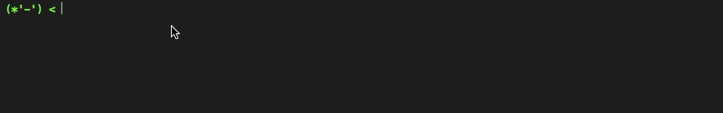

# Termimori

It allows user to create element like Terminal.



## Example & Demo

[Example](http://mimorisuzuko.github.io/termimori/) from `docs/index.js`

* `zoi`: Show "今日も1日がんばるぞい！" in Termimori
* `tweet`: Open tweet window

```javascript
const Termimori = require('../');
const _ = require('lodash');

const termimori = new Termimori(document.querySelector('.sample'), [
	{
		color: 'rgb(0, 255, 0)',
		innerText: '(*\'-\') < '
	}
]);
termimori.on('zoi', () => '今日も1日がんばるぞい！').on('tweet', (args) => {
	const q = _.slice(args._, 1);
	window.open(`http://twitter.com/?status=${q}`);
	return `${q} とツイートしました`;
});
```

## API

### `Termimori(Element, { color: String, innerText: innerText }[])`

#### `Element`

Termimori creates element under `Element`.

#### `{ color: String, innerText: innerText }[]`

The array is like a prompt.

* `color`: Set color of text
* `innerText`: Set text for showing in Termimori

### `on(command: String, f: Function)`

* `command`: Set command name
* `f`: When typed command, the function that has a argument parsed by minimist is executed.