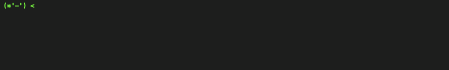

# Termimori

Termimori allows user to create element like Terminal.

## Example & Demo

[Example](http://mimorisuzuko.github.io/termimori/) from [`docs/index.js`](./src/index.js)

* `zoi`: Show "今日も1日がんばるぞい！" in Termimori
* `tweet`: Open tweet window

## API

### `Termimori(parentElement, promptChildren)`

#### `parentElement: Element`

Termimori creates element under `Element`.

#### `promptChildren: { color: String, innerText: String, id: String }[]`

The role of array is like a prompt.

* `color`: Set a color of text
* `innerText`: Set text for showing in Termimori
* `id`: Set id of child

### `on(command: String, f: Function)`

* `command`: Set command name
* `f`: When typed a command, the function that has a argument parsed by `minimist` is executed

### `prompt(id: String, after: String)`

When typed a command, change the text of child that has `id` to `after`.